4. Eksplorasi Data Menggunakan R
================
Muhammad Luqman
2018-04-29

# Exploratory Data Analysis Menggunakan R

Dalam statistik, *Exploratory Data Analysis* (EDA) adalah teknik untuk
menganalisis data dengan tujuan untuk melihat karakteristik data
tersebut. EDA seringkali dilakukan dengan menggunakan teknik
visualisasi. Dengan menggunakan library `ggplot2`, kita dapat melakukan
visualisasi data dalam R untuk melakukan EDA.

``` r
library(dplyr)
library(ggplot2)
```

# Eksplorasi Data Kategorikal

## Mempersiapkan Data

``` r
library(hflights)
hflights = as_tibble(hflights)
hflights
```

    ## # A tibble: 227,496 × 21
    ##     Year Month DayofMonth DayOfWeek DepTime ArrTime UniqueCarrier FlightNum
    ##    <int> <int>      <int>     <int>   <int>   <int> <chr>             <int>
    ##  1  2011     1          1         6    1400    1500 AA                  428
    ##  2  2011     1          2         7    1401    1501 AA                  428
    ##  3  2011     1          3         1    1352    1502 AA                  428
    ##  4  2011     1          4         2    1403    1513 AA                  428
    ##  5  2011     1          5         3    1405    1507 AA                  428
    ##  6  2011     1          6         4    1359    1503 AA                  428
    ##  7  2011     1          7         5    1359    1509 AA                  428
    ##  8  2011     1          8         6    1355    1454 AA                  428
    ##  9  2011     1          9         7    1443    1554 AA                  428
    ## 10  2011     1         10         1    1443    1553 AA                  428
    ## # ℹ 227,486 more rows
    ## # ℹ 13 more variables: TailNum <chr>, ActualElapsedTime <int>, AirTime <int>,
    ## #   ArrDelay <int>, DepDelay <int>, Origin <chr>, Dest <chr>, Distance <int>,
    ## #   TaxiIn <int>, TaxiOut <int>, Cancelled <int>, CancellationCode <chr>,
    ## #   Diverted <int>

``` r
str(hflights)
```

    ## tibble [227,496 × 21] (S3: tbl_df/tbl/data.frame)
    ##  $ Year             : int [1:227496] 2011 2011 2011 2011 2011 2011 2011 2011 2011 2011 ...
    ##  $ Month            : int [1:227496] 1 1 1 1 1 1 1 1 1 1 ...
    ##  $ DayofMonth       : int [1:227496] 1 2 3 4 5 6 7 8 9 10 ...
    ##  $ DayOfWeek        : int [1:227496] 6 7 1 2 3 4 5 6 7 1 ...
    ##  $ DepTime          : int [1:227496] 1400 1401 1352 1403 1405 1359 1359 1355 1443 1443 ...
    ##  $ ArrTime          : int [1:227496] 1500 1501 1502 1513 1507 1503 1509 1454 1554 1553 ...
    ##  $ UniqueCarrier    : chr [1:227496] "AA" "AA" "AA" "AA" ...
    ##  $ FlightNum        : int [1:227496] 428 428 428 428 428 428 428 428 428 428 ...
    ##  $ TailNum          : chr [1:227496] "N576AA" "N557AA" "N541AA" "N403AA" ...
    ##  $ ActualElapsedTime: int [1:227496] 60 60 70 70 62 64 70 59 71 70 ...
    ##  $ AirTime          : int [1:227496] 40 45 48 39 44 45 43 40 41 45 ...
    ##  $ ArrDelay         : int [1:227496] -10 -9 -8 3 -3 -7 -1 -16 44 43 ...
    ##  $ DepDelay         : int [1:227496] 0 1 -8 3 5 -1 -1 -5 43 43 ...
    ##  $ Origin           : chr [1:227496] "IAH" "IAH" "IAH" "IAH" ...
    ##  $ Dest             : chr [1:227496] "DFW" "DFW" "DFW" "DFW" ...
    ##  $ Distance         : int [1:227496] 224 224 224 224 224 224 224 224 224 224 ...
    ##  $ TaxiIn           : int [1:227496] 7 6 5 9 9 6 12 7 8 6 ...
    ##  $ TaxiOut          : int [1:227496] 13 9 17 22 9 13 15 12 22 19 ...
    ##  $ Cancelled        : int [1:227496] 0 0 0 0 0 0 0 0 0 0 ...
    ##  $ CancellationCode : chr [1:227496] "" "" "" "" ...
    ##  $ Diverted         : int [1:227496] 0 0 0 0 0 0 0 0 0 0 ...

``` r
lookup = c(A = "Carrier", B = "Weather", C = "National Air System", D = "Security")

hflights = hflights %>%
  mutate(CancellationReason = lookup[CancellationCode])
```

## Tabel Kontingensi

``` r
ct = table(hflights$UniqueCarrier, hflights$Cancelled)
ct
```

    ##     
    ##          0     1
    ##   AA  3184    60
    ##   AS   365     0
    ##   B6   677    18
    ##   CO 69557   475
    ##   DL  2599    42
    ##   EV  2128    76
    ##   F9   832     6
    ##   FL  2118    21
    ##   MQ  4513   135
    ##   OO 15837   224
    ##   UA  2038    34
    ##   US  4036    46
    ##   WN 44640   703
    ##   XE 71921  1132
    ##   YV    78     1

``` r
prop.table(ct)
```

    ##     
    ##                 0            1
    ##   AA 1.399585e-02 2.637409e-04
    ##   AS 1.604424e-03 0.000000e+00
    ##   B6 2.975876e-03 7.912227e-05
    ##   CO 3.057504e-01 2.087949e-03
    ##   DL 1.142438e-02 1.846186e-04
    ##   EV 9.354011e-03 3.340718e-04
    ##   F9 3.657207e-03 2.637409e-05
    ##   FL 9.310054e-03 9.230932e-05
    ##   MQ 1.983771e-02 5.934170e-04
    ##   OO 6.961441e-02 9.846327e-04
    ##   UA 8.958399e-03 1.494532e-04
    ##   US 1.774097e-02 2.022014e-04
    ##   WN 1.962232e-01 3.090164e-03
    ##   XE 3.161418e-01 4.975912e-03
    ##   YV 3.428632e-04 4.395682e-06

``` r
prop.table(ct, margin = 1)
```

    ##     
    ##                0           1
    ##   AA 0.981504316 0.018495684
    ##   AS 1.000000000 0.000000000
    ##   B6 0.974100719 0.025899281
    ##   CO 0.993217386 0.006782614
    ##   DL 0.984096933 0.015903067
    ##   EV 0.965517241 0.034482759
    ##   F9 0.992840095 0.007159905
    ##   FL 0.990182328 0.009817672
    ##   MQ 0.970955250 0.029044750
    ##   OO 0.986053172 0.013946828
    ##   UA 0.983590734 0.016409266
    ##   US 0.988731014 0.011268986
    ##   WN 0.984495953 0.015504047
    ##   XE 0.984504401 0.015495599
    ##   YV 0.987341772 0.012658228

``` r
prop.table(ct, margin = 2)
```

    ##     
    ##                 0            1
    ##   AA 0.0141811752 0.0201816347
    ##   AS 0.0016256686 0.0000000000
    ##   B6 0.0030152813 0.0060544904
    ##   CO 0.3097989961 0.1597712748
    ##   DL 0.0115756515 0.0141271443
    ##   EV 0.0094778709 0.0255634040
    ##   F9 0.0037056337 0.0020181635
    ##   FL 0.0094333320 0.0070635721
    ##   MQ 0.0201003906 0.0454086781
    ##   OO 0.0705362034 0.0753447696
    ##   UA 0.0090770211 0.0114362597
    ##   US 0.0179758867 0.0154725866
    ##   WN 0.1988215016 0.2364614867
    ##   XE 0.3203279842 0.3807601749
    ##   YV 0.0003474032 0.0003363606

## Grafik

``` r
ggplot(hflights, aes(x = Cancelled)) + 
  geom_bar()
```

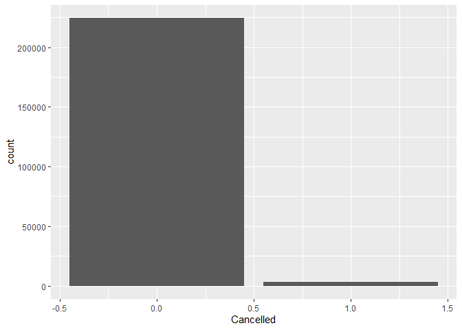

``` r
hflights %>%
  filter(Cancelled == 1) %>%
  ggplot(aes(x = CancellationReason)) + 
  geom_bar()
```

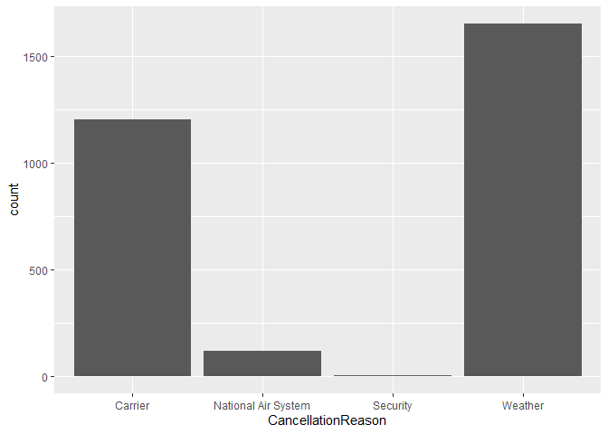

``` r
ggplot(hflights, aes(x = UniqueCarrier, fill = Cancelled)) + 
  geom_bar(position = "dodge")
```

    ## Warning: The following aesthetics were dropped during statistical transformation: fill
    ## ℹ This can happen when ggplot fails to infer the correct grouping structure in
    ##   the data.
    ## ℹ Did you forget to specify a `group` aesthetic or to convert a numerical
    ##   variable into a factor?

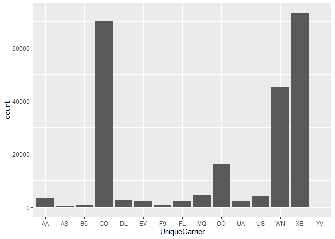

``` r
ggplot(hflights, aes(x = UniqueCarrier, fill = Cancelled)) + 
  geom_bar(position = "fill")
```

    ## Warning: The following aesthetics were dropped during statistical transformation: fill
    ## ℹ This can happen when ggplot fails to infer the correct grouping structure in
    ##   the data.
    ## ℹ Did you forget to specify a `group` aesthetic or to convert a numerical
    ##   variable into a factor?

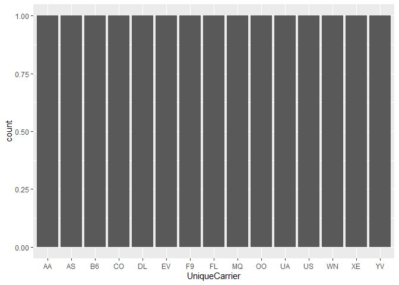

``` r
hflights %>% 
  filter(Cancelled == 1) %>%
  ggplot(aes(x = UniqueCarrier,
                       fill = CancellationCode)) + 
  geom_bar(position = "fill")
```

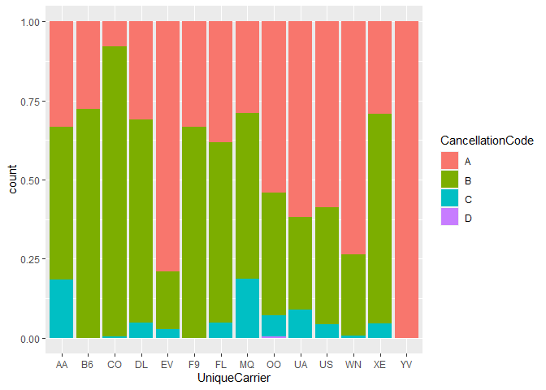

# Eksplorasi Data Numerikal

``` r
ggplot(hflights, aes(x = AirTime)) +
  geom_histogram()
```

    ## `stat_bin()` using `bins = 30`. Pick better value with `binwidth`.

    ## Warning: Removed 3622 rows containing non-finite values (`stat_bin()`).

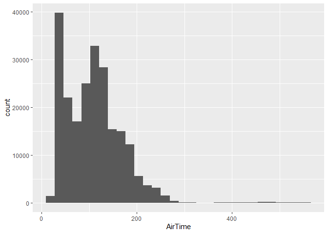

``` r
ggplot(hflights, aes(x = AirTime)) +
  geom_histogram(binwidth = 60)
```

    ## Warning: Removed 3622 rows containing non-finite values (`stat_bin()`).

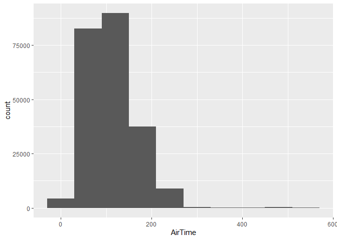

``` r
ggplot(hflights, aes(x = AirTime)) +
  geom_histogram() +
  facet_wrap(~Origin)
```

    ## `stat_bin()` using `bins = 30`. Pick better value with `binwidth`.

    ## Warning: Removed 3622 rows containing non-finite values (`stat_bin()`).

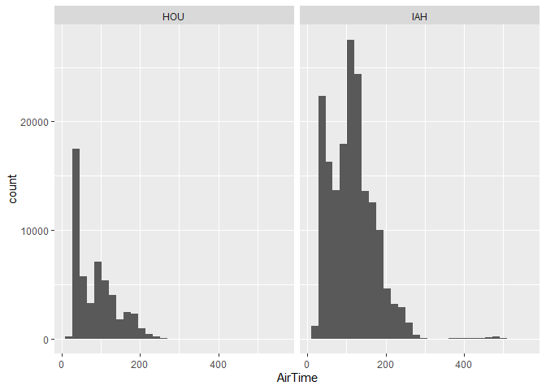

``` r
ggplot(hflights, aes(x = AirTime)) +
  geom_density()
```

    ## Warning: Removed 3622 rows containing non-finite values (`stat_density()`).

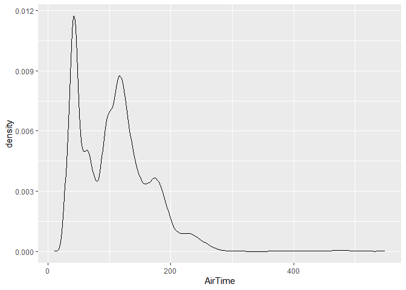

``` r
ggplot(hflights, aes(x = AirTime, fill = Origin)) +
  geom_density(alpha = 0.3)
```

    ## Warning: Removed 3622 rows containing non-finite values (`stat_density()`).

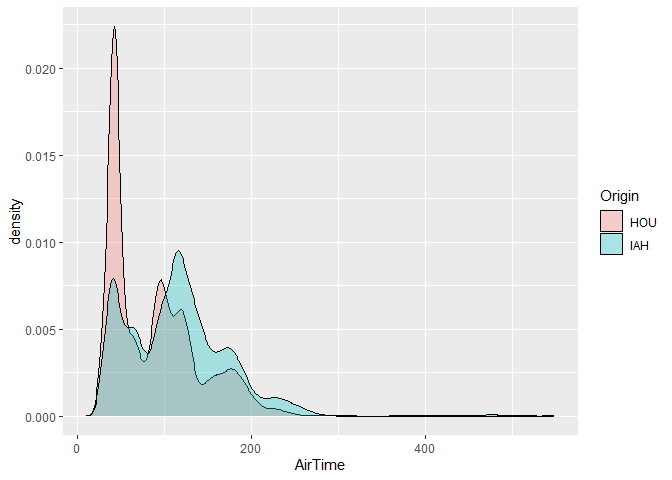

``` r
ggplot(hflights, aes(x = 1, y = Distance)) +
  geom_boxplot()
```

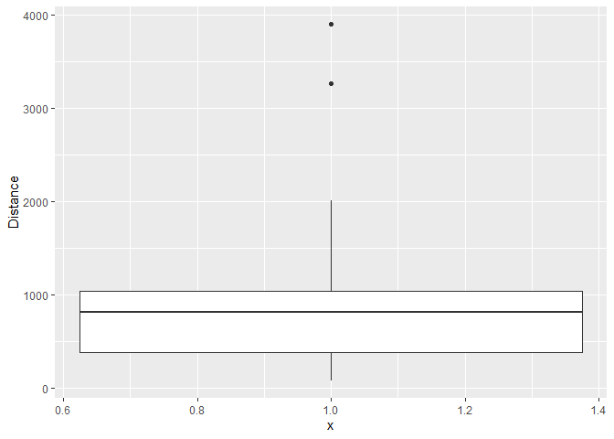

``` r
ggplot(hflights, aes(x = Origin, y = Distance)) +
  geom_boxplot()
```

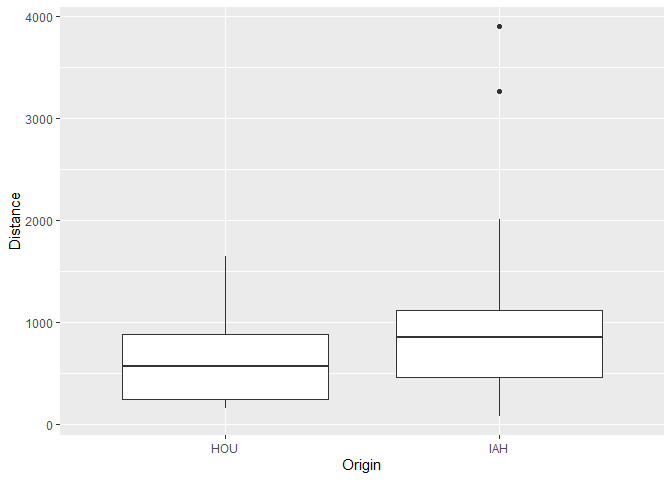

``` r
ggplot(hflights, aes(x = Distance, y = AirTime)) +
  geom_point()
```

    ## Warning: Removed 3622 rows containing missing values (`geom_point()`).

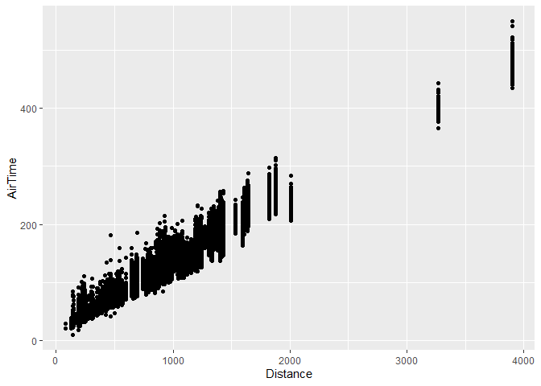

# Ukuran Pusat dan Penyebaran

## Mempersiapkan Data

``` r
library(gapminder)
gap2007 = gapminder %>% 
  filter(year == 2007, continent != "Oceania")
gap2007
```

    ## # A tibble: 140 × 6
    ##    country     continent  year lifeExp       pop gdpPercap
    ##    <fct>       <fct>     <int>   <dbl>     <int>     <dbl>
    ##  1 Afghanistan Asia       2007    43.8  31889923      975.
    ##  2 Albania     Europe     2007    76.4   3600523     5937.
    ##  3 Algeria     Africa     2007    72.3  33333216     6223.
    ##  4 Angola      Africa     2007    42.7  12420476     4797.
    ##  5 Argentina   Americas   2007    75.3  40301927    12779.
    ##  6 Austria     Europe     2007    79.8   8199783    36126.
    ##  7 Bahrain     Asia       2007    75.6    708573    29796.
    ##  8 Bangladesh  Asia       2007    64.1 150448339     1391.
    ##  9 Belgium     Europe     2007    79.4  10392226    33693.
    ## 10 Benin       Africa     2007    56.7   8078314     1441.
    ## # ℹ 130 more rows

## Grafik Angka Harapan Hidup antar Benua

``` r
gap2007 %>%
  ggplot(aes(x = continent, y = lifeExp)) +
  geom_boxplot()
```

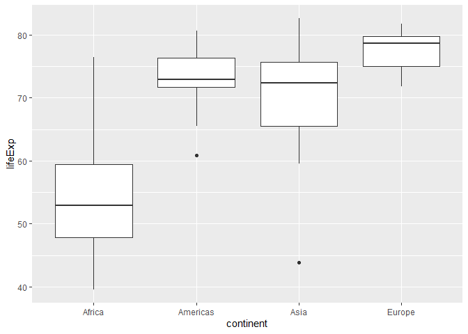

``` r
gap2007 %>%
  ggplot(aes(x = lifeExp, fill = continent)) +
  geom_density(alpha = 0.3)
```

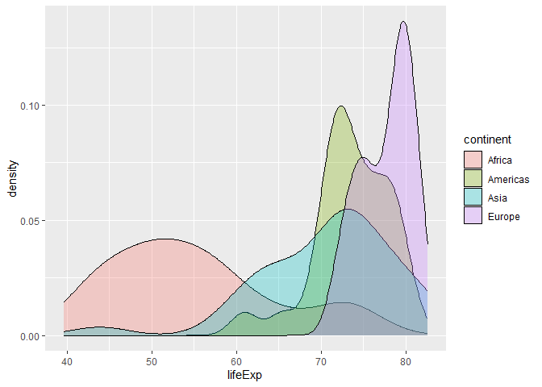

## Menghitung Ukuran Pemusatan antar Benua

``` r
gap2007 %>%
  group_by(continent) %>%
  summarize(mean(lifeExp),
            median(lifeExp))
```

    ## # A tibble: 4 × 3
    ##   continent `mean(lifeExp)` `median(lifeExp)`
    ##   <fct>               <dbl>             <dbl>
    ## 1 Africa               54.8              52.9
    ## 2 Americas             73.6              72.9
    ## 3 Asia                 70.7              72.4
    ## 4 Europe               77.6              78.6

## Menghitung Ukuran Penyebaran antar Benua

``` r
gap2007 %>%
  group_by(continent) %>%
  summarize(varians = var(lifeExp),
            std = sd(lifeExp),
            iqr = IQR(lifeExp),
            n_data = n())
```

    ## # A tibble: 4 × 5
    ##   continent varians   std   iqr n_data
    ##   <fct>       <dbl> <dbl> <dbl>  <int>
    ## 1 Africa      92.8   9.63 11.6      52
    ## 2 Americas    19.7   4.44  4.63     25
    ## 3 Asia        63.4   7.96 10.2      33
    ## 4 Europe       8.88  2.98  4.78     30
