5. Praktikum R
================
Muhammad Luqman
2018-07-06

# Praktikum

Dalam pertemuan ini akan dilakukan praktikum menggunakan contoh kasus
yang akan memperkuat materi Pertemuan 1 sampai dengan Pertemuan 4. Dalam
praktikum ini, semua syntax akan di hide secara default

## Exploratory Data Analysis

**Load Package yang Dibutuhkan**  
Load package `dplyr` yang dibutuhkan untuk melakukan EDA

``` r
library(<package>)
```

``` r
library(dplyr)
```

**Import data dan ubah ke dalam bentuk tibble**  
Data yang digunakan pada pertemuan ini adalah file `gapminder.csv` yang
telah disediakan. Load ke dalam R menggunakan fungsi `read.csv()` dan
simpan ke dalam variabel `gapdata` lalu ubah ke dalam bentuk tibble
menggunakan fungsi `as_tibble()` dari package `dplyr`.

``` r
gapdata = read.csv(<path ke file>) %>%
  as_tibble()
gapdata
```

``` r
gapdata = read.csv('gapminder.csv') %>%
  as_tibble()
gapdata
```

    ## # A tibble: 1,704 × 6
    ##    country     continent  year lifeExp      pop gdpPercap
    ##    <chr>       <chr>     <int>   <dbl>    <int>     <dbl>
    ##  1 Afghanistan Asia       1952    28.8  8425333      779.
    ##  2 Afghanistan Asia       1957    30.3  9240934      821.
    ##  3 Afghanistan Asia       1962    32.0 10267083      853.
    ##  4 Afghanistan Asia       1967    34.0 11537966      836.
    ##  5 Afghanistan Asia       1972    36.1 13079460      740.
    ##  6 Afghanistan Asia       1977    38.4 14880372      786.
    ##  7 Afghanistan Asia       1982    39.9 12881816      978.
    ##  8 Afghanistan Asia       1987    40.8 13867957      852.
    ##  9 Afghanistan Asia       1992    41.7 16317921      649.
    ## 10 Afghanistan Asia       1997    41.8 22227415      635.
    ## # ℹ 1,694 more rows

**Struktur Data**  
Lihat struktur data yang ada menggunakan fungsi `str()` dan `summary()`

``` r
str(<variabel>)
summary(<variabel>)
```

``` r
str(gapdata)
```

    ## tibble [1,704 × 6] (S3: tbl_df/tbl/data.frame)
    ##  $ country  : chr [1:1704] "Afghanistan" "Afghanistan" "Afghanistan" "Afghanistan" ...
    ##  $ continent: chr [1:1704] "Asia" "Asia" "Asia" "Asia" ...
    ##  $ year     : int [1:1704] 1952 1957 1962 1967 1972 1977 1982 1987 1992 1997 ...
    ##  $ lifeExp  : num [1:1704] 28.8 30.3 32 34 36.1 ...
    ##  $ pop      : int [1:1704] 8425333 9240934 10267083 11537966 13079460 14880372 12881816 13867957 16317921 22227415 ...
    ##  $ gdpPercap: num [1:1704] 779 821 853 836 740 ...

``` r
summary(gapdata)
```

    ##    country           continent              year         lifeExp     
    ##  Length:1704        Length:1704        Min.   :1952   Min.   :23.60  
    ##  Class :character   Class :character   1st Qu.:1966   1st Qu.:48.20  
    ##  Mode  :character   Mode  :character   Median :1980   Median :60.71  
    ##                                        Mean   :1980   Mean   :59.47  
    ##                                        3rd Qu.:1993   3rd Qu.:70.85  
    ##                                        Max.   :2007   Max.   :82.60  
    ##       pop              gdpPercap       
    ##  Min.   :6.001e+04   Min.   :   241.2  
    ##  1st Qu.:2.794e+06   1st Qu.:  1202.1  
    ##  Median :7.024e+06   Median :  3531.8  
    ##  Mean   :2.960e+07   Mean   :  7215.3  
    ##  3rd Qu.:1.959e+07   3rd Qu.:  9325.5  
    ##  Max.   :1.319e+09   Max.   :113523.1

**Periksa Missing Value**  
Missing value dapat mempengaruhi analisis deskriptif yang akan
dilakukan, periksa apakah ada observasi yang mengandung missing value
manggunakan fungsi `complete.cases()`. Perlu diperhatikan fungsi ini
mengembalikan nilai `TRUE` apabila observasi **tidak mengandung**
missing value

``` r
sum(!complete.cases(<variabel>))
```

``` r
sum(!complete.cases(gapdata))
```

    ## [1] 0

**Identifikasi Variabel**  
Dari data yang ada, hitung jumlah observasi (jumlah baris), jumlah
tahun, jumlah negara, dan tahun paling baru dari observasi yang ada.
Gabungkan `summarise()` dengan fungsi `n()`, `n_distinct()` dan `max()`
sesuai dengan kolom yang bersangkutan

``` r
gapdata %>% 
  summarise(jumlah_row = <>, jumlah_tahun = <>, 
            jumlah_negara = <>, max_tahun = <>)
```

``` r
gapdata %>% 
  summarise(jumlah_row = n(), jumlah_tahun = n_distinct(year), 
            jumlah_negara = n_distinct(country), max_tahun = max(year))
```

    ## # A tibble: 1 × 4
    ##   jumlah_row jumlah_tahun jumlah_negara max_tahun
    ##        <int>        <int>         <int>     <int>
    ## 1       1704           12           142      2007

**Filter Data**  
Dalam praktikum ini, data yang digunakan hanya data dari tahun terakhir,
filter dataset `gapdata` berdasarkan tahun terakhir yang telah dicari
sebelumnya menggunakan fungsi `filter()` dan simpan hasilnya ke dalam
variael `gapdata_recent`

``` r
gapdata_recent = gapdata %>%
  filter(<filter tahun terakhir>)
```

``` r
gapdata_recent = gapdata %>%
  filter(year == 2007)
```

**Analisis Sederhana**  
Dari data `gapdata_recent`, cari negara yang memiliki GDP per Kapita
tertinggi dan terendah. Gunakan fungsi `filter()` dan pilih negara yang
memiliki nilai `gdpPercap` tertinggi **atau** terendah

``` r
gapdata_recent %>%
  filter(<kolom> == max(<kolom>) | <kolom> == min(<kolom>))
```

``` r
gapdata_recent %>%
  filter(gdpPercap == max(gdpPercap) | gdpPercap == min(gdpPercap))
```

    ## # A tibble: 2 × 6
    ##   country          continent  year lifeExp      pop gdpPercap
    ##   <chr>            <chr>     <int>   <dbl>    <int>     <dbl>
    ## 1 Congo, Dem. Rep. Africa     2007    46.5 64606759      278.
    ## 2 Norway           Europe     2007    80.2  4627926    49357.

Lanjutkan dengan mencari negara yang memiliki GDP per Kapita tertinggi
dan terendah per benua. Gabungkan syntax di atas dengan fungsi
`group_by()` untuk mengrup data berdasarkan kolom `continent` kemudian
urutkan menggunakan fungsi `arrange()` berdasarkan kolom `continent` dan
`gdpPercap`

``` r
gapdata_recent %>%
  group_by(<kolom>) %>%
  filter(gdpPercap == max(gdpPercap) | gdpPercap == min(gdpPercap)) %>%
  arrange(<kolom>, <kolom>)
```

``` r
gapdata_recent %>%
  group_by(continent) %>%
  filter(gdpPercap == max(gdpPercap) | gdpPercap == min(gdpPercap)) %>%
  arrange(continent, gdpPercap)
```

    ## # A tibble: 10 × 6
    ## # Groups:   continent [5]
    ##    country          continent  year lifeExp       pop gdpPercap
    ##    <chr>            <chr>     <int>   <dbl>     <int>     <dbl>
    ##  1 Congo, Dem. Rep. Africa     2007    46.5  64606759      278.
    ##  2 Gabon            Africa     2007    56.7   1454867    13206.
    ##  3 Haiti            Americas   2007    60.9   8502814     1202.
    ##  4 United States    Americas   2007    78.2 301139947    42952.
    ##  5 Myanmar          Asia       2007    62.1  47761980      944 
    ##  6 Kuwait           Asia       2007    77.6   2505559    47307.
    ##  7 Albania          Europe     2007    76.4   3600523     5937.
    ##  8 Norway           Europe     2007    80.2   4627926    49357.
    ##  9 New Zealand      Oceania    2007    80.2   4115771    25185.
    ## 10 Australia        Oceania    2007    81.2  20434176    34435.

**Analisis per Benua**  
Buat variabel baru `gapdata_continent` yang merangkum analisis
deskriptif setiap benua berisi jumlah negara per benua; nilai maksimum,
minimum dan rata-rata untuk Life Expectacy Populasi dan GDP per Kapita

``` r
gapdata_continent = gapdata_recent %>%
  group_by(<kolom>) %>%
  summarise(n = <>, 
            max_lifeExp = <>, min_lifeExp = <>, 
            avg_lifeExp = <>, max_pop = <>, min_pop = <>, 
            avg_pop = <>, max_gdpPercap = <>, 
            min_gdpPercap = <>, avg_gdpPercap = <>)
gapdata_continent
```

``` r
gapdata_continent = gapdata_recent %>%
  group_by(continent) %>%
  summarise(n = n(), 
            max_lifeExp = max(lifeExp), min_lifeExp = min(lifeExp), 
            avg_lifeExp = mean(lifeExp), max_pop = max(pop), min_pop = min(pop), 
            avg_pop = mean(pop), max_gdpPercap = max(gdpPercap), 
            min_gdpPercap = min(gdpPercap), avg_gdpPercap = mean(gdpPercap))
gapdata_continent
```

    ## # A tibble: 5 × 11
    ##   continent     n max_lifeExp min_lifeExp avg_lifeExp    max_pop min_pop avg_pop
    ##   <chr>     <int>       <dbl>       <dbl>       <dbl>      <int>   <int>   <dbl>
    ## 1 Africa       52        76.4        39.6        54.8  135031164  199579  1.79e7
    ## 2 Americas     25        80.7        60.9        73.6  301139947 1056608  3.60e7
    ## 3 Asia         33        82.6        43.8        70.7 1318683096  708573  1.16e8
    ## 4 Europe       30        81.8        71.8        77.6   82400996  301931  1.95e7
    ## 5 Oceania       2        81.2        80.2        80.7   20434176 4115771  1.23e7
    ## # ℹ 3 more variables: max_gdpPercap <dbl>, min_gdpPercap <dbl>,
    ## #   avg_gdpPercap <dbl>

# Visualisasi Data

Load package `ggplot2` yang dibutuhkan untuk melakukan visualisasi data

``` r
library(<package>)
```

``` r
library(ggplot2)
```

## Histogram dan Density Plot

Membuat histogram dan density plot untuk keseluruhan data menggunakan
fungsi `geom_histogram()` dan `geom_density()`

``` r
gapdata_recent %>% 
  ggplot(aes(x = gdpPercap)) + geom_histogram()
```

    ## `stat_bin()` using `bins = 30`. Pick better value with `binwidth`.

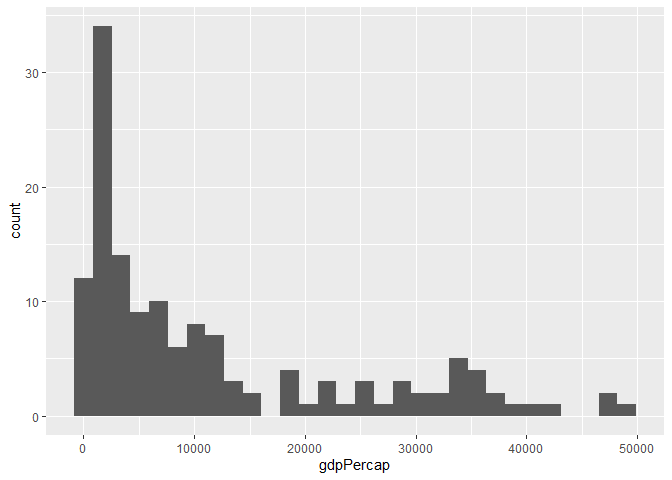<!-- -->

``` r
gapdata_recent %>% 
  ggplot(aes(x = gdpPercap)) + geom_density()
```

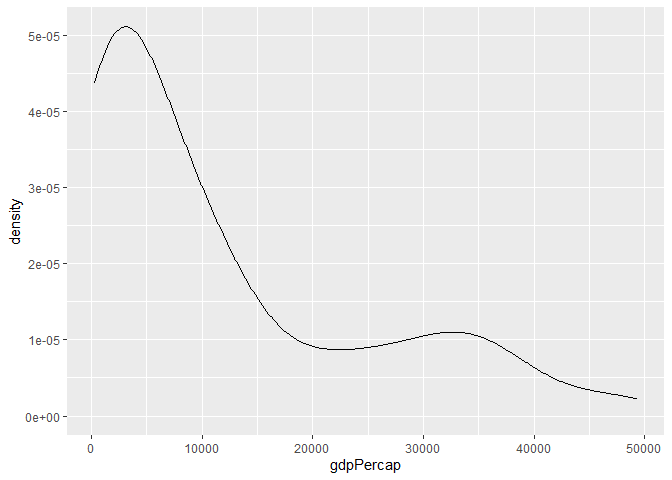<!-- -->

Membuat histogram dan density plot untuk data per benua menggunakan
`facet_wrap()`

``` r
gapdata_recent %>% 
  filter(continent != 'Oceania') %>%
  ggplot(aes(x = gdpPercap, fill = continent)) + geom_histogram(bins = 10) + facet_wrap(~ continent)
```

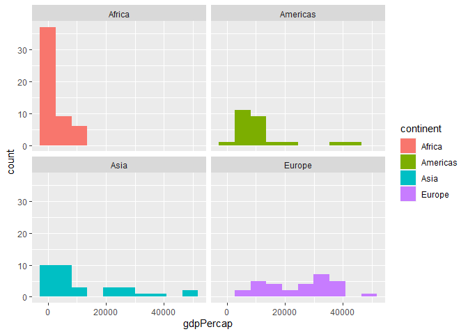<!-- -->

``` r
gapdata_recent %>% 
  filter(continent != 'Oceania') %>%
  ggplot(aes(x = gdpPercap, fill = continent)) + geom_density() + facet_wrap(~ continent)
```

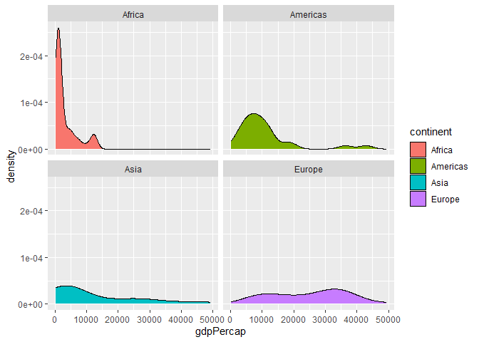<!-- -->

## Box Plot

Membuat box plot pendapatan untuk keseluruhan data menggunakan fungsi
`geom_boxplot()`

``` r
gapdata_recent %>%
  filter(continent != 'Oceania') %>%
  ggplot(aes(x = 1, y = gdpPercap)) + geom_boxplot()
```

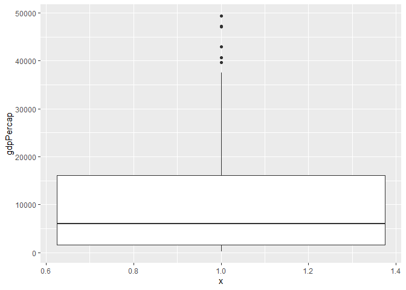<!-- -->

Membuat box plot pendapatan per benua dengan mengatur parameter `x` dan
`fill`

``` r
gapdata_recent %>%
  filter(continent != 'Oceania') %>%
  ggplot(aes(x = continent, y = gdpPercap, fill = continent)) + geom_boxplot()
```

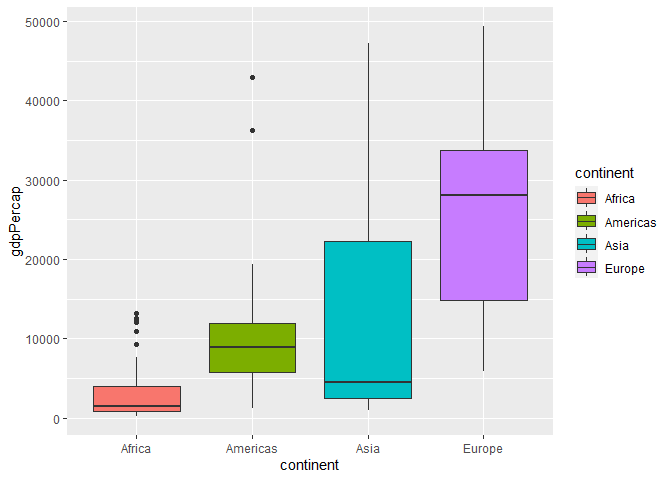<!-- -->

## Scatter Plot

Membuat scatter plot antara GDP per Kapita dan Life Expectacy untuk
keseluruhan data dan membandingkan sebaran data tiap benua

``` r
gapdata_recent %>%
  ggplot(aes(x = gdpPercap, y = lifeExp, color = continent)) + geom_point()
```

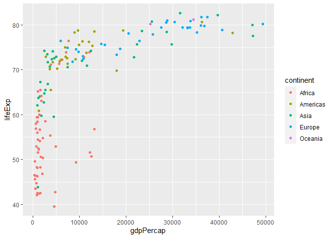<!-- -->

``` r
gapdata_recent %>%
  ggplot(aes(x = log(gdpPercap), y = lifeExp, color = continent)) + geom_point()
```

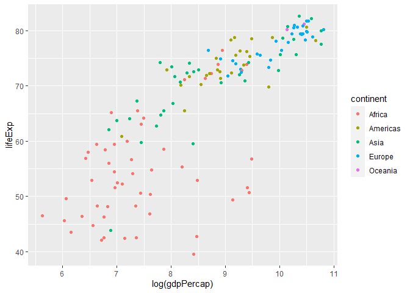<!-- -->

``` r
gapdata_recent %>%
  ggplot(aes(x = gdpPercap, y = lifeExp)) + geom_point() + 
  geom_smooth(formula = y ~log(x))
```

    ## `geom_smooth()` using method = 'loess'

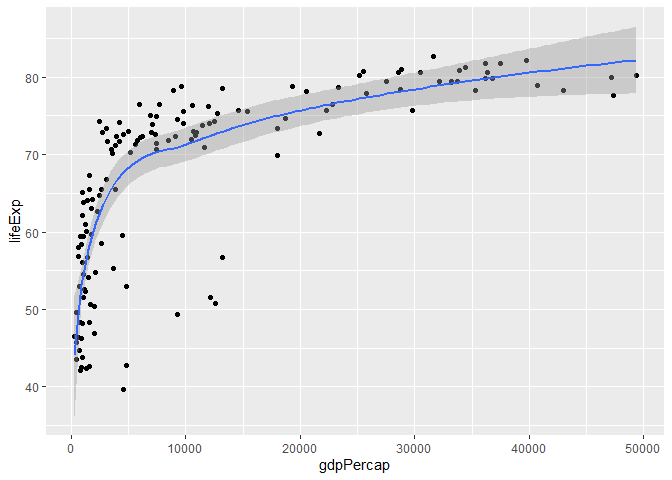<!-- -->

``` r
cor(gapdata_recent$gdpPercap, gapdata_recent$lifeExp)
```

    ## [1] 0.6786624

Membuat scatter plot antara populasi dan GDP per Kapita / Life Expectacy
untuk melihat hubungan diantara keduanya

``` r
gapdata_recent %>%
  ggplot(aes(x = pop, y = gdpPercap)) + geom_point()
```

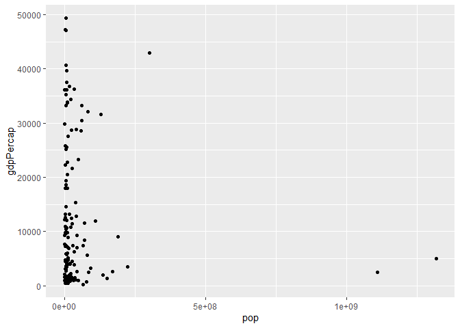<!-- -->

``` r
gapdata_recent %>%
  ggplot(aes(x = pop, y = lifeExp)) + geom_point()
```

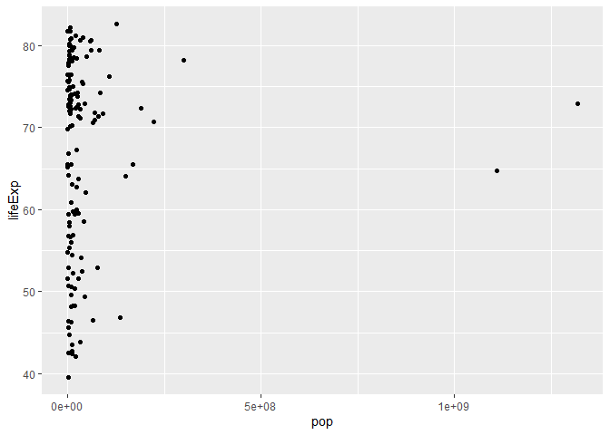<!-- -->

``` r
cor(gapdata_recent$pop, gapdata_recent$lifeExp)
```

    ## [1] 0.04755312

## Bar Chart

### Count

Memplot jumlah negara setiap benua menggunakan fungsi `geom_bar()`

``` r
gapdata_recent %>%
  ggplot(aes(x = continent)) + geom_bar()
```

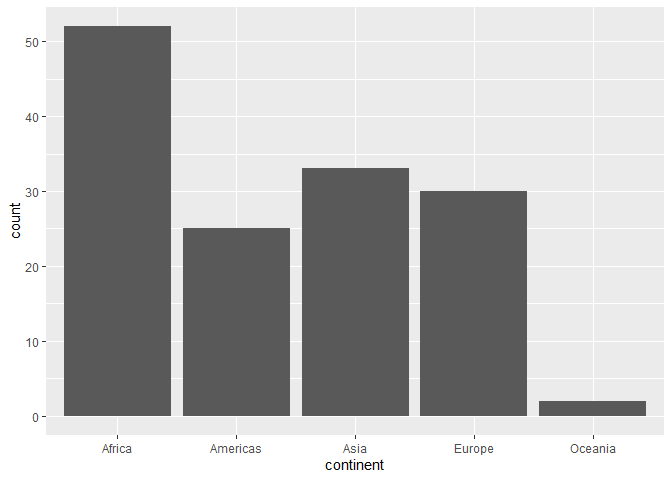<!-- -->

Memplot jumlah negara setiap benua yang memiliki Life Expectacy di bawah
rata-rata dan di atas rata-rata

``` r
gapdata_recent = gapdata_recent %>%
  mutate(level = case_when(
    lifeExp >= mean(lifeExp) ~ "high",
    lifeExp < mean(lifeExp) ~ "low"
  ))

gapdata_recent %>%
  ggplot(aes(x = continent, fill = level)) + geom_bar(position = "stack") 
```

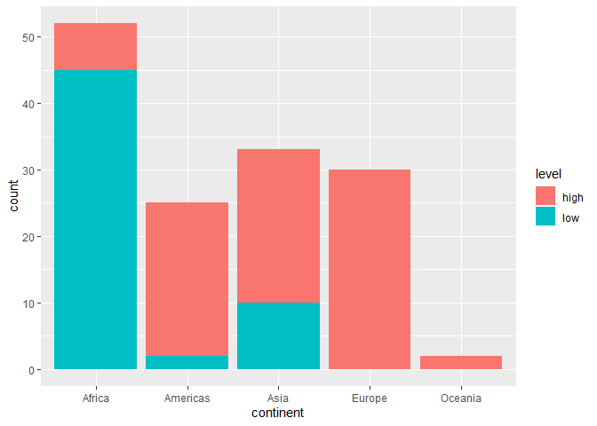<!-- -->

``` r
gapdata_recent %>%
  ggplot(aes(x = continent, fill = level)) + geom_bar(position = "dodge")
```

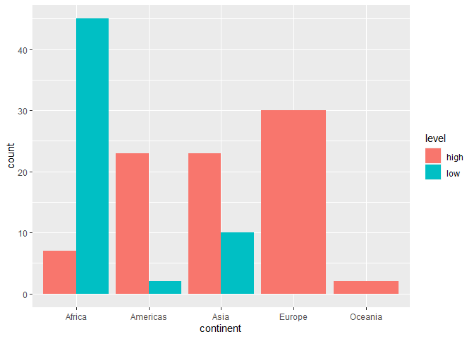<!-- -->

``` r
gapdata_recent %>%
  ggplot(aes(x = continent, fill = level)) + geom_bar(position = "fill")
```

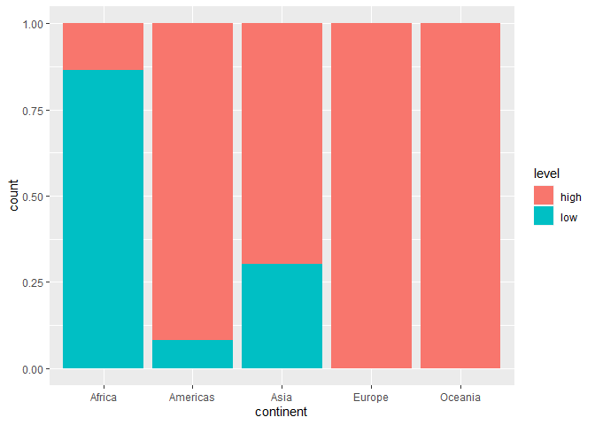<!-- -->

### Value

Memplot nilai rata-rata Life Expectacy tiap benua dari variabel
`gapdata_continent` yang telah dibuat sebelumnya menggunakan fungsi
`geom_col()`

``` r
gapdata_continent %>%
  ggplot(aes(x = continent, fill = continent, y = avg_lifeExp)) + geom_col()
```

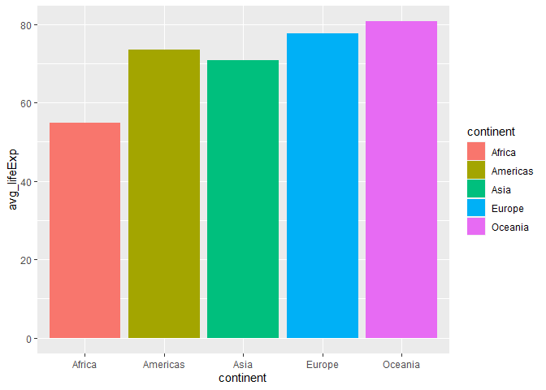<!-- -->

``` r
gapdata_continent %>%
  ggplot(aes(x = continent, fill = continent, y = avg_lifeExp)) + geom_col() + coord_flip()
```

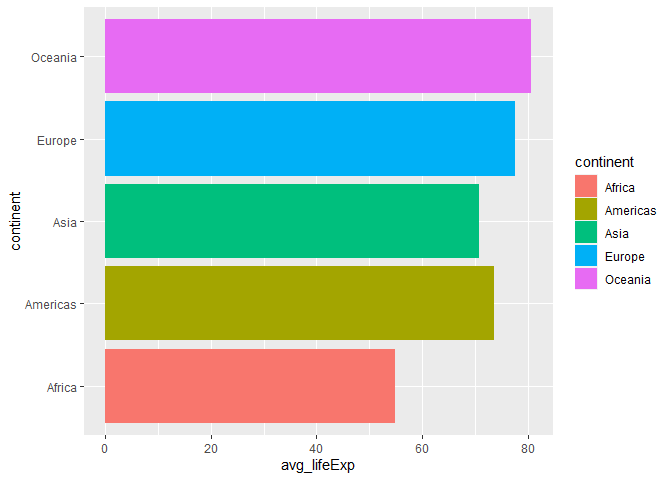<!-- -->

## Line Chart

Membuat trend line variabel GDP per Kapita, Populasi dan Life Expectacy
untuk setiap negara di ASEAN menggunakan `geom_line()`

``` r
asean = c("Indonesia", "Singapore", "Thailand", "Cambodia", "Malaysia",
          "Myanmar", "Philippines", "Vietnam")

gapdata_asean = gapdata %>%
  filter(country %in% asean)

gapdata_asean %>%
  ggplot(aes(x = year, y = gdpPercap, color = country)) + geom_line()
```

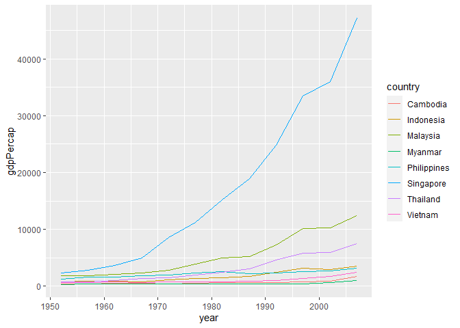<!-- -->

``` r
gapdata_asean %>%
  ggplot(aes(x = year, y = pop, color = country)) + geom_line()
```

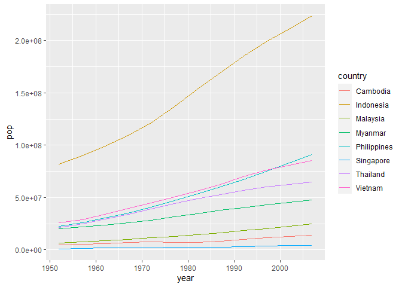<!-- -->

``` r
gapdata_asean %>%
  ggplot(aes(x = year, y = lifeExp, color = country)) + geom_line()
```

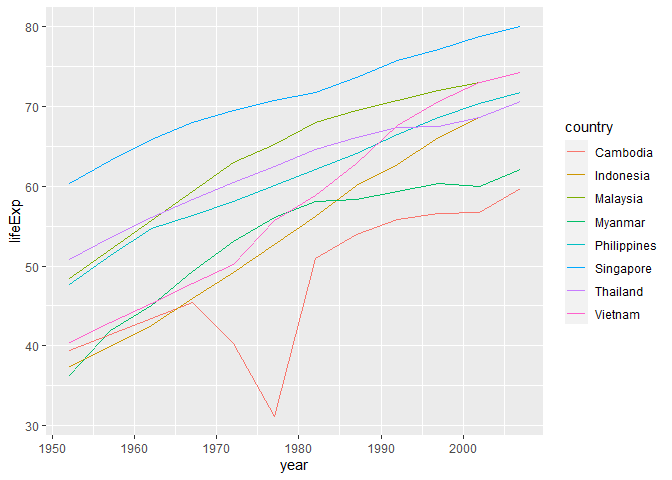<!-- -->
